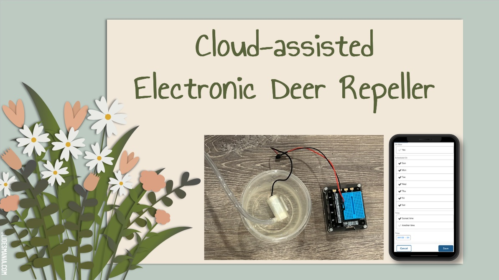
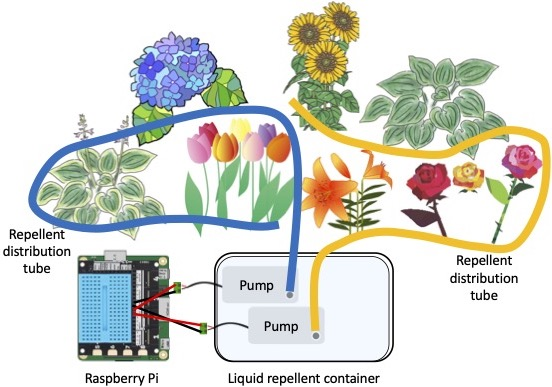
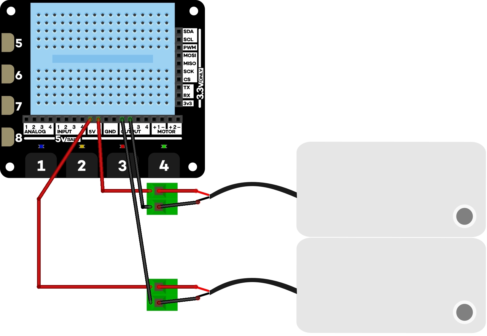

  

### Short Project Summary

This project builds an electronic deer repeller, called The Ultimate Deer Repeller (TUDR), to address a nuisance issue where wild deer damage home gardens. TUDR is an outdoor, in-garden system that distributes liquid repellent around garden plants with liquid pumps controlled by a Raspberry Pi computer. It runs a Python program that periodically contacts a cloud database and triggers repellent distribution. The database’s data entry form allows gardeners to remotely set up and adjust the repellent distribution schedule with their smartphones, tablets, or web browsers.

This project was submitted to and presented at [AnimalHack 2023](https://AnimalHack.org). It won an [Honorable Mention](https://animalhack-2023.devpost.com/project-gallery). 

  

  

### Publication: 

- Hanna Suzuki, "Cloud-assisted Electronic Deer Repeller," In S. Ouchi, Y. Karube and B. Ouchi (eds.), *[Unleashing Technology Innovations for Positive Human-animal Relationships: Tales from AnimalHack 2023](https://www.amazon.com/dp/B0CSBPT21P)*, Chapter 1, pp. 1 - 17, Binnovative, ISBN: 979-8-8722-5466-9, January 2024.

